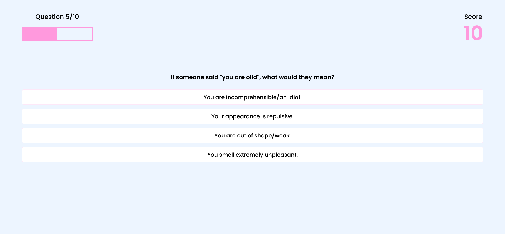

# Quiz Game

This is a source code for the quiz game.

## Table of contents

- [Overview](#overview)
  - [Description](#description)
  - [Screenshot](#screenshot)
  - [Links](#links)
- [My process](#my-process)
  - [Built with](#built-with)
- [Author](#author)

## Overview

### Description

Users should be able to:

- View the optimal layout for the site depending on their device's screen size
- See how many questions left or in which question they are
- Choose the difficulty level
- See the correct answer after choosing an option
- See their score during the game and after it is finished

### Screenshot

### Links

- Solution URL: [https://github.com/HasanliLaman/quiz-game](https://github.com/HasanliLaman/quiz-game)
- Live Site URL: [https://hasanlilaman.github.io/quiz-game/](https://hasanlilaman.github.io/quiz-game/)

## My process

### Built with

- Semantic HTML5 markup
- CSS custom properties
- Grid
- Mobile-first workflow
- Javascript
- [Api](https://opentdb.com/api_config.php)

## Author

- Github - [Laman Hasanli](https://github.com/HasanliLaman)
